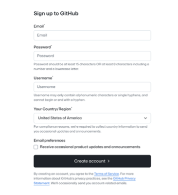
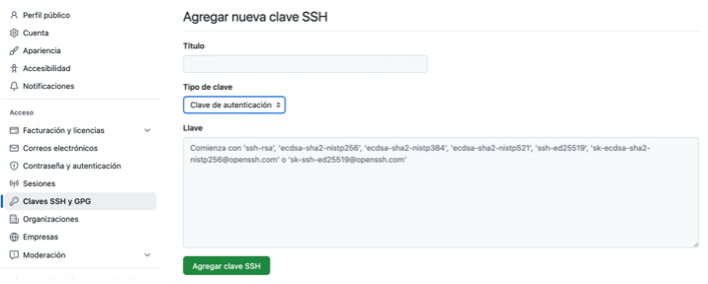
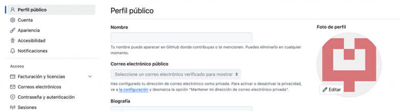
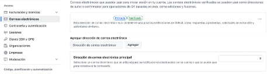
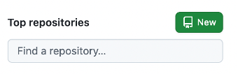
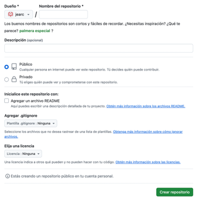
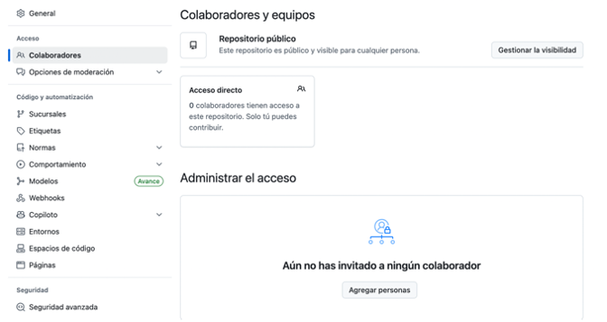

<p align="center">
  
</p>

<h1 align="center"><code>GITHUB</code></h1>


<h2>Introducción</h2>

<p>
  <strong>GitHub</strong> es el servidor más grande utilizado por Git y representa el punto de encuentro de millones de desarrolladores que colaboran en proyectos de código abierto (<em>open source</em>).
</p>

<p>
  En este capítulo veremos el uso correcto de GitHub: cómo crear y gestionar una cuenta, cómo crear y administrar repositorios, así como flujos de trabajo que permiten colaborar en proyectos existentes o aceptar nuevos participantes en los tuyos.
</p>

---

<h2>Creación y configuración de la cuenta</h2>

<p>
  Para crear una cuenta en GitHub, ingresa a 
  <a href="https://github.com" target="_blank">https://github.com</a>. 
  Elige un nombre de usuario disponible, proporciona un correo electrónico, una contraseña segura, selecciona tu ciudad o región y haz clic en el botón <strong>Create account</strong>.
</p>

<div align="center">
  
</div>

<p>
  Con esto, ya tendrás una cuenta activa en GitHub. Desde este momento puedes utilizar Git a través del protocolo <code>HTTP</code>, autenticándote con el nombre de usuario y la contraseña que acabas de registrar.
</p>

<p>
  A continuación, explicaremos cómo configurar el acceso mediante <code>SSH</code> para una conexión más segura y sin necesidad de ingresar la contraseña cada vez.
</p>


<h3>Acceso SSH</h3>

<p>
  Como vimos en el capítulo anterior, para configurar el acceso mediante <strong>SSH</strong> necesitas generar una clave pública. 
  Una vez que la tengas, ingresa a <strong>GitHub</strong>, haz clic en el ícono ubicado en la parte superior derecha y selecciona la opción <strong>Settings</strong> (Ajustes).
</p>

<p>
  En el panel lateral, selecciona <strong>SSH and GPG keys</strong>. Luego haz clic en el botón <strong>New SSH key</strong>.
</p>

<div align="center">
  
</div>

<p>
  Asigna un título descriptivo a tu clave, por ejemplo <em>“Cuenta de trabajo”</em>, para que sea fácil identificarla en caso de que necesites revocarla. Luego, pega el contenido de tu clave pública en el campo correspondiente y haz clic en el botón <strong>Add SSH key</strong>.
</p>

<div align="center">
  
</div>


<h3>Tu icono</h3>

<p>
  En el mismo panel de <strong>Ajustes</strong> puedes cambiar el ícono predeterminado de tu perfil. 
  Para hacerlo, selecciona la opción <strong>Perfil público</strong> y haz clic en el botón <strong>Editar</strong> sobre tu imagen de perfil. 
  Ahí tendrás la opción de subir una foto desde tu computadora.
</p>

<div align="center">
  
</div>

<h3>Tus direcciones de correo</h3>

<p>
  Git utiliza tu <strong>correo electrónico</strong> para identificar tus contribuciones a los repositorios. 
  Para agregar o modificar tus correos, ve a la sección <strong>Correos electrónicos</strong> dentro del menú de Ajustes.
</p>

<div align="center">
  
</div>

---

<h2>Participando en Proyectos</h2>

<p>
  Después de tener tu cuenta configurada, el siguiente paso es <strong>contribuir a un proyecto</strong>. 
  GitHub facilita la colaboración en proyectos open source y privados mediante funcionalidades como <em>forks</em>, <em>pull requests</em>, y asignación de issues.
</p>

<p>
  Puedes comenzar buscando proyectos que te interesen y, si el repositorio es público, puedes crear un <strong>fork</strong>, hacer tus cambios en una rama y luego enviar un <code>pull request</code> para que los administradores del proyecto revisen tu propuesta.
</p>


<h3>Bifurcación (Fork) de Proyectos</h3>

<p>
  Si deseas colaborar en un proyecto en el que no tienes permisos de escritura, puedes hacer un <strong>fork</strong>. Esto consiste en crear una <em>copia del repositorio</em> en tu propia cuenta de GitHub, donde podrás realizar los cambios que desees.
</p>

<p>
  Una vez que hayas realizado tus modificaciones, puedes enviar esos cambios al proyecto original mediante una solicitud llamada <strong><code>pull request</code></strong>. El administrador del proyecto puede revisarlos, darte retroalimentación, integrarlos al proyecto principal o rechazarlos.
</p>

<p>
  Para hacer esto, entra al repositorio del proyecto donde quieres participar y haz clic en el botón <strong>"Fork"</strong>, que se encuentra en la parte superior derecha de la página.
</p>

<p>
  Este proceso inicia la base para una futura <strong>pull request</strong>, que explicaremos más adelante.
</p>


<h3>Flujo de Trabajo en GitHub</h3>

<p>
  GitHub está diseñado con un <strong>flujo de trabajo de colaboración específico</strong>, centrado en las solicitudes de integración (<em>pull requests</em>). Este flujo de trabajo sigue los siguientes pasos:
</p>

<ul>
  <li>Se crea una rama a partir de <code>main</code>.</li>
  <li>Se realizan uno o más <code>commits</code> en esa rama.</li>
  <li>Se envía esa rama a tu <strong>fork</strong> del proyecto.</li>
  <li>Se abre un <strong>Pull Request</strong> en GitHub.</li>
  <li>Se participa en la discusión asociada y, opcionalmente, se hacen nuevos commits.</li>
  <li>El propietario del repositorio original <strong>fusiona</strong> tus cambios o los <strong>rechaza</strong>.</li>
</ul>

<p>
  Este modelo se conoce como <strong>flujo de trabajo de Administrador-Integración</strong>, donde GitHub actúa como medio de comunicación en lugar del correo electrónico.
</p>

<p>
  El flujo completo para contribuir a un proyecto usando un fork es el siguiente:
</p>

<ol>
  <li>Clonar el <strong>fork</strong> en tu equipo local.</li>
  <li>Realizar los cambios necesarios en tu copia del proyecto.</li>
  <li>Verificar que los cambios funcionen correctamente.</li>
  <li>Hacer <code>commit</code> de los cambios.</li>
  <li>Enviar los <code>commits</code> a tu fork en GitHub.</li>
  <li>GitHub te mostrará la opción de crear una solicitud de integración (<strong>Pull Request</strong>) hacia el repositorio original.</li>
</ol>


<h3>Pull Requests como parches</h3>

<p>
Los <strong>Pull Requests</strong> son colas de <em>parches</em> perfectamente ordenadas que se pueden aplicar limpiamente uno tras otro. 
Son comúnmente considerados como <strong>conversaciones evolutivas</strong> sobre un cambio propuesto.
</p>

<p>
Cuando se envía un cambio mediante un Pull Request y los colaboradores sugieren ajustes, <strong>los parches originales no se modifican directamente</strong>. 
En su lugar, se realiza un nuevo <code>commit</code> sobre la misma rama que contiene únicamente la diferencia solicitada, materializando así las sugerencias recibidas.
</p>

<h3>Manteniéndonos actualizados</h3>

<p>
Si el <strong>Pull Request</strong> se queda anticuado o ya no puede fusionarse limpiamente con la rama principal, lo más común es actualizarlo para facilitar su integración por parte del responsable del proyecto.
</p>

<p>
Para resolver esto, puedes reorganizar tu rama con el contenido más reciente de <code>main</code> o fusionar directamente la rama objetivo con la tuya.
</p>

<p>La forma más común es <strong>fusionar la rama principal</strong> con tu rama. Para ello, sigue estos pasos:</p>

<ol>
  <li>Añadir el repositorio original como un nuevo remoto.</li>
  <li>Fusionar la rama <code>main</code> del repositorio original con tu rama local.</li>
  <li>Resolver los conflictos o errores que surjan.</li>
  <li>Enviar los cambios a la rama en la que realizaste la solicitud de integración (Pull Request).</li>
</ol>

---

<h2>Markdown</h2>

<p>
El formato <strong>Markdown</strong> en GitHub permite escribir en texto plano que luego se convierte en texto con formato visualmente atractivo.
</p>

<p>
Este lenguaje es muy útil para documentar proyectos, redactar <code>README.md</code> y otras secciones en repositorios. Además, puedes complementar Markdown con <strong>código HTML</strong> para agregar tablas, listas, imágenes, estilos adicionales y mucho más.
</p>


<h3>Lista de tareas</h3>

<p>
Una <strong>lista de tareas</strong> es una forma de mostrar elementos pendientes, marcando aquellos que ya han sido completados. Son especialmente útiles para hacer seguimiento del progreso en un proyecto.
</p>

<p>Puedes crear una lista de tareas en Markdown con la siguiente sintaxis:</p>

```bash
- [X] Write the code
- [ ] Write all the tests
- [ ] Document the code
```

<p>
GitHub convierte automáticamente estas listas en listas interactivas, permitiéndote <strong>marcar o desmarcar tareas directamente desde la interfaz</strong>, sin necesidad de editar el comentario original.
</p>


<h3>Fragmentos de código</h3>

<p>
Puedes insertar <strong>fragmentos de código</strong> para documentar, reportar errores o mostrar salidas de comandos, especialmente útil al colaborar en GitHub.
</p>

<p>
Para agregar un bloque de código con resaltado de sintaxis, usa tres acentos invertidos (<code>```</code>) seguidos del nombre del lenguaje. Por ejemplo:
</p>

```bash
```java
for (int i = 0; i &lt; 5; i++) {
    System.out.println("i is : " + i);
}
```
```

<p>
Si mencionas el lenguaje (como <code>java</code> en este caso), GitHub aplicará automáticamente <strong>resaltado de sintaxis</strong> para una mejor visualización.
</p>


<h3>Emojis</h3>

<p>
Los <strong>emojis</strong> se utilizan comúnmente en GitHub para expresar emociones, añadir un toque de humor o hacer más amigable una conversación técnica.
</p>

<p>
Para insertar un emoji, se utiliza la sintaxis <code>:nombre_del_emoji:</code>. Por ejemplo:
</p>

```bash
:smile:
```

<p>
Esto se convertirá automáticamente en 😀 al visualizarlo en GitHub.
</p>

<p>
Puedes consultar la <a href="https://github.com/ikatyang/emoji-cheat-sheet" target="_blank">emoji cheat sheet</a> para ver todos los emojis disponibles.
</p>

---

<h2>Mantenimiento de un proyecto</h2>

<p>
Ahora que ya sabes cómo colaborar en un proyecto, veremos cómo puedes <strong>crear</strong>, <strong>administrar</strong> y <strong>mantener</strong> tu propio repositorio en GitHub.
</p>

<p>
Tener tu propio proyecto implica tareas como definir el propósito del repositorio, establecer buenas prácticas para contribuir, mantener actualizada la documentación, revisar <em>pull requests</em> y responder a <em>issues</em> abiertos por otros usuarios.
</p>

<p>
En las siguientes secciones exploraremos cómo estructurar tu proyecto, establecer flujos de trabajo eficientes y fomentar una comunidad activa que pueda colaborar contigo.
</p>


<h3>Creación de un repositorio</h3>

<p>
En tu página principal de GitHub, en el menú ubicado a la derecha, busca un botón verde que dice <strong>"New"</strong>.
</p>

<div align="center">
  
</div>

<p>
Ese botón abrirá un formulario en el que deberás ingresar el <strong>nombre del repositorio</strong>, una <strong>descripción</strong> opcional, elegir si el repositorio será <strong>público o privado</strong>, y marcar algunas opciones como:
</p>

<ul>
  <li>Agregar un archivo <code>README</code> (altamente recomendable, más adelante explicaremos qué es).</li>
  <li>Agregar un archivo <code>.gitignore</code> (útil para excluir archivos innecesarios del control de versiones).</li>
  <li>Agregar una <strong>licencia</strong> para definir cómo se puede usar tu proyecto.</li>
</ul>

<div align="center">
  
</div>

<p>
Una vez creado el repositorio, GitHub te mostrará la <strong>URL del repositorio</strong>, que podrás compartir con otros usuarios. Puedes clonarlo usando HTTP o SSH, según lo tengas configurado.
</p>


<h2>Añadir colaboradores</h2>

<p>
Si necesitas trabajar con otras personas en un repositorio, debes agregarlas como <strong>colaboradores</strong>. Para ello, es necesario que cada persona tenga una cuenta de GitHub.
</p>

<p>
Dentro de tu repositorio, busca la opción de <strong>"Settings" (Ajustes)</strong> en la barra de herramientas superior. Una vez dentro, selecciona <strong>"Collaborators"</strong> en el menú lateral izquierdo. Luego haz clic en <strong>"Add people"</strong>.
</p>

<p>
Escribe el <strong>nombre de usuario</strong> de la persona que deseas agregar y selecciónala de la lista que aparece.
</p>

<div align="center">
  
</div>

<h3>Gestión de los Pull Requests</h3>

<p>
Los <strong>Pull Requests</strong> pueden provenir de una rama del mismo repositorio o de una <strong>bifurcación (fork)</strong> del proyecto. En el caso de una bifurcación, se trata de cambios propuestos por personas que no tienen permisos de escritura en tu repositorio, pero que desean contribuir con mejoras o correcciones.
</p>

<p>
Cuando alguien abre un Pull Request en tu proyecto, recibirás una <strong>notificación por correo electrónico</strong>. Este correo incluye un resumen tipo <code>diffstat</code>, un enlace directo al Pull Request en GitHub y varias URL útiles para trabajar desde la línea de comandos.
</p>

<p>
Las URL que terminan en <code>.diff</code> y <code>.patch</code> proporcionan archivos en formato <strong>diff unificado</strong> y <strong>parches</strong> compatibles con herramientas de control de versiones.
</p>


<h3>Colaboración con Pull Request</h3>

<p>
Puedes participar en una discusión con la persona que creó el <strong>Pull Request</strong>. Es posible <strong>comentar líneas específicas de código</strong>, hacer observaciones sobre commits individuales o dejar comentarios generales en el Pull Request completo.
</p>

<p>
En todo momento puedes utilizar el formato <code>Markdown</code> para mejorar la claridad de tus comentarios, añadiendo listas, fragmentos de código o tareas pendientes.
</p>

<p>
Una vez finalizada la discusión, puedes <strong>fusionar los cambios</strong> con tu rama principal o, si decides que los cambios no deben integrarse, simplemente puedes <strong>cerrar el Pull Request</strong>. En ambos casos, la persona que lo creó recibirá una notificación.
</p>


<h3>README</h3>

<p>
El archivo <code>README</code> puede tener distintas extensiones, siendo la más común <strong>README.md</strong>. Cuando GitHub detecta este archivo, lo muestra automáticamente en la página principal del repositorio, renderizando su contenido de acuerdo al formato Markdown.
</p>

<p>
Este archivo se utiliza generalmente para proporcionar <strong>información clave sobre el repositorio</strong>, incluyendo:
</p>

<ul>
  <li>¿Para qué es el proyecto?</li>
  <li>Cómo se configura e instala</li>
  <li>Ejemplos de uso</li>
  <li>Licencia del código</li>
  <li>Cómo contribuir al desarrollo</li>
</ul>

<p>
Además, puedes <strong>agregar imágenes, enlaces, tablas y fragmentos de código</strong> para mejorar la comprensión y presentación del proyecto.
</p>


<h3>CONTRIBUTING</h3>

<p>
El archivo <code>CONTRIBUTING</code> le indica a los colaboradores <strong>cómo participar correctamente en el proyecto</strong>. Es una guía útil para mantener la calidad del código y la coherencia del equipo de desarrollo.
</p>

<p>Algunos de los elementos que suele incluir son:</p>

<ul>
  <li><strong>Instrucciones para contribuir</strong>: cómo clonar el repositorio, crear ramas, hacer commits y abrir pull requests.</li>
  <li><strong>Requisitos técnicos</strong>: lenguajes, versiones, dependencias o herramientas necesarias para contribuir.</li>
  <li><strong>Estilo de código</strong>: guías de formato, nombres de variables, uso de espacios, comentarios, etc.</li>
  <li><strong>Herramientas necesarias</strong>: linters, frameworks, entornos de desarrollo recomendados.</li>
  <li><strong>Criterios de aceptación</strong>: requisitos mínimos que debe cumplir una contribución para ser aceptada.</li>
  <li><strong>Cosas por evitar</strong>: malas prácticas o acciones que no son bienvenidas en el proyecto.</li>
</ul>

<p>
Este archivo se recomienda incluirlo en la raíz del repositorio como <code>CONTRIBUTING.md</code> para que GitHub lo muestre automáticamente cuando alguien intente crear un nuevo issue o pull request.
</p>


---

<h2>Conclusiones</h2>

<p>
En este punto, ya tienes <strong>una cuenta de GitHub creada y configurada</strong>. Aprendiste a:
</p>

<ul>
  <li><strong>Crear y administrar repositorios</strong> desde cero.</li>
  <li><strong>Colaborar en proyectos</strong> ajenos mediante bifurcaciones (<em>forks</em>) y solicitudes de integración (<em>pull requests</em>).</li>
  <li><strong>Gestionar contribuciones externas</strong> a tus propios proyectos, aceptando cambios de terceros y participando en discusiones de código.</li>
</ul>

<p>
Con estos conocimientos, puedes empezar a trabajar de forma colaborativa en proyectos de código abierto o privados, y mantener un flujo de trabajo profesional utilizando GitHub como plataforma central.
</p>

---

## <span style="color:#9E9D24"><strong>Licencia</strong></span>

Este contenido está licenciado bajo [Creative Commons Attribution-NonCommercial 4.0 (CC BY-NC 4.0)](https://creativecommons.org/licenses/by-nc/4.0/).  
Puedes compartirlo, adaptarlo y utilizarlo con fines educativos y no comerciales, siempre que des crédito al autor original:

> **Jesús Eduardo Arciniega Tlacomulco**

---

<p align="center">
    
</p>

<p align="center"><i>Desarrollado por Jesús Eduardo Arciniega Tlacomulco – Curso de Git y GitHub</i></p>